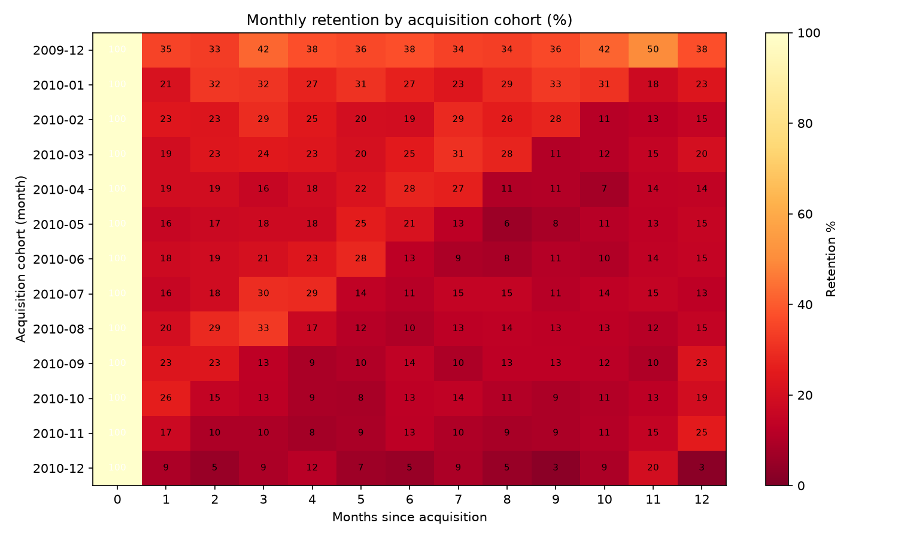
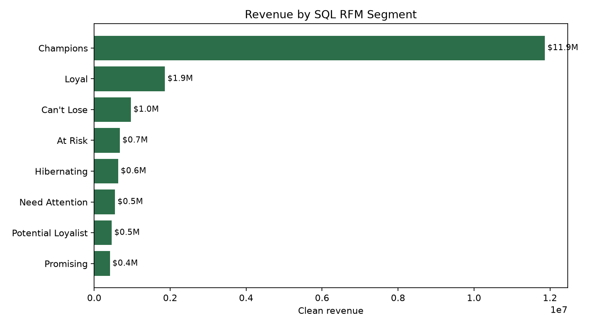
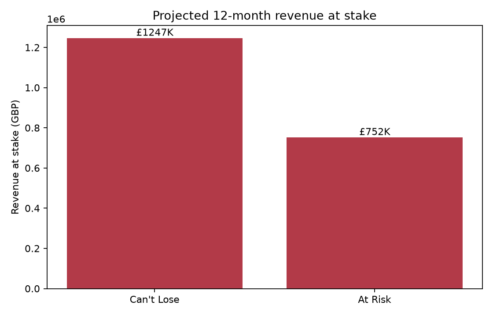
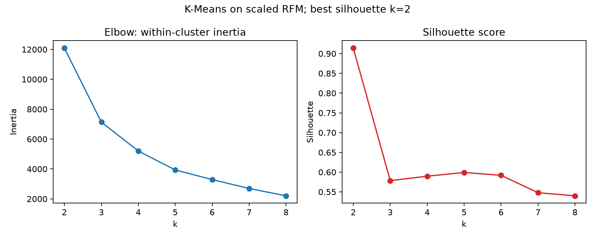

# Retail Customer Analytics

**SQL-first customer analytics for RFM segmentation, cohort retention, and revenue-at-risk targeting.**
Clean transactions → build RFM segments → project CLV → publish a CRM dashboard.


---

## Headline Result

The cleaned Online Retail II transaction file contains **5,852 customers** and **£17.43M** in merchandise revenue. Revenue is highly concentrated: the top **10%** of customers drive **63.9%** of revenue. A transparent RFM + cohort CLV workflow identifies **335 high-value slipping customers** with **£1.999M** in projected 12-month revenue at stake.

Live dashboard: [https://kylez8.github.io/retail-customer-analytics/](https://kylez8.github.io/retail-customer-analytics/)

## SQL Layer

DuckDB SQL is the source of truth for the customer analytics layer:

| SQL view | Purpose |
|---|---|
| `transactions_clean` | Removes cancellations, non-product fee/adjustment rows, missing customer IDs, and non-positive quantity or price rows. |
| `customer_base` | One row per customer: first/last order, orders, line items, revenue, tenure, and recency. |
| `rfm_scores` | Recency, frequency, and monetary quintiles with deterministic tie-breakers. |
| `rfm_segments` | Marketing-readable segments such as Champions, Loyal, Can't Lose, At Risk, and Hibernating. |
| `cohort_retention` | Monthly acquisition-cohort retention matrix. |
| `revenue_concentration` | Pareto curve for cumulative customers vs. cumulative revenue. |

## Segment Table

| Segment | Customers | Revenue | Revenue share | Use |
|---|---:|---:|---:|---|
| Champions | 1,281 | £11,869,575 | 68.1% | Protect with loyalty and early-access offers. |
| Loyal | 699 | £1,863,209 | 10.7% | Grow basket size and frequency. |
| Can't Lose | 232 | £966,514 | 5.5% | Highest-priority save campaign. |
| At Risk | 599 | £676,251 | 3.9% | Win-back campaign, prioritized by value. |
| Hibernating | 1,511 | £633,618 | 3.6% | Low-cost nurture or suppression. |

K-Means on scaled RFM is useful as a diagnostic, but its best silhouette result is a two-cluster split. For CRM activation, the SQL RFM labels are more useful because they are stable, explainable, and map directly to campaign actions.

## Retention Heatmap



Retention drops sharply after acquisition month. That makes recency a practical operating signal: customers with strong historical value but weak recent activity are the most urgent retention target.

## CLV and Revenue at Risk

CLV is intentionally transparent: historical customer value plus a cohort-based 12-month projection. No lifetime assumptions or Bayesian model are used.

| Target group | Customers | Historical value | 12-month revenue at stake |
|---|---:|---:|---:|
| Can't Lose | 232 | £966,514 | £1,246,714 |
| At Risk | 103 | £329,675 | £752,339 |
| **Total** | **335** | **£1,296,189** | **£1,999,052** |

Only **103** of the **599** At Risk customers are targeted because the activation list applies a value threshold: At Risk customers must be in the top two monetary quintiles (`m_score >= 4`). The remaining At Risk customers are still monitored, but they are better suited to lower-cost nurture rather than the priority save campaign.

The ranked CRM activation list is written to `outputs/revenue_at_risk_targeting_list.csv`. Tableau-ready aggregate CSVs are in `tableau/`.

## Figures







## How to Run

```bash
make setup
make data
make notebooks
make test
```

`make data` downloads the UCI source file to `data/raw/` and writes cleaned data to `data/processed/`. Both folders are gitignored because the source file is too large to commit.

CI runs `ruff check .` and `pytest` on Python 3.13. Tests use only the committed fixture in `data/fixtures/`, so CI does not download the full dataset.

## Dashboard

The self-contained Plotly dashboard is generated at:

- `dashboard/index.html`
- `docs/index.html` for GitHub Pages

It uses aggregate CSV outputs only: KPI tiles, Pareto curve, cohort heatmap, segment table, and revenue at risk by segment.

## Data Attribution

Dataset: UCI Machine Learning Repository, **Online Retail II** (id 502), CC BY 4.0.

Citation: Chen, D. (2019). Online Retail II [Dataset]. UCI Machine Learning Repository. https://doi.org/10.24432/C5CG6D

The raw source is a UK online retail transaction file from December 2009 through December 2011. All monetary amounts are GBP (£). The committed fixture is a small, anonymized test sample; raw and processed full-data files are not committed.

## Limitations

- Revenue is gross transaction value, not margin.
- The 12-month projection is cohort-based and intentionally simple; it should be recalibrated after campaign results arrive.
- RFM does not infer causality. Campaign lift must be measured with a randomized holdout.
- Missing customer IDs are excluded because the analysis is customer-level; that removes guest/unregistered transactions from customer analytics.

Part of a six-project data analytics portfolio — see [github.com/KyleZ8](https://github.com/KyleZ8)
